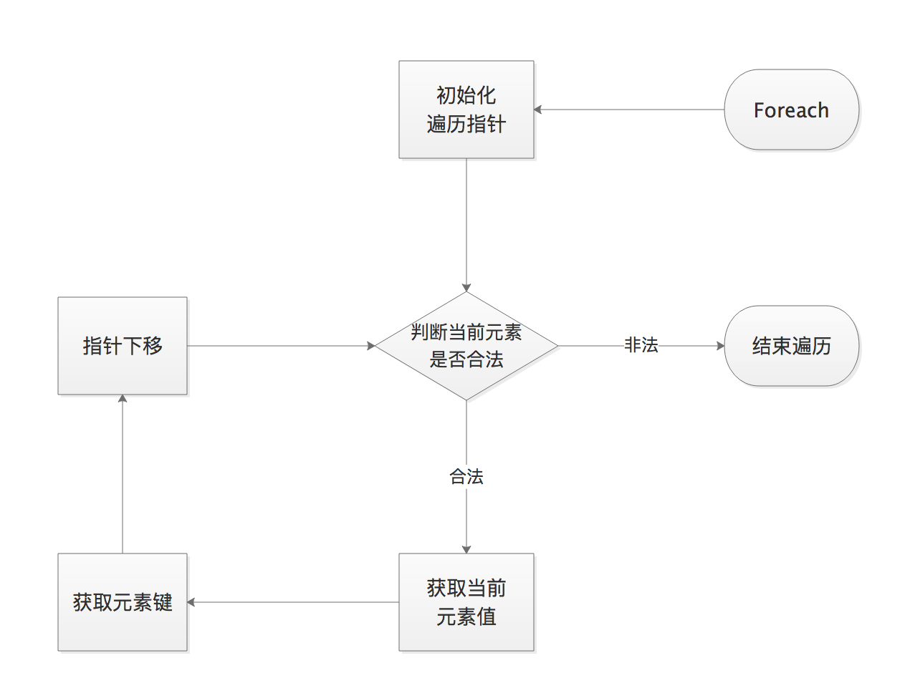
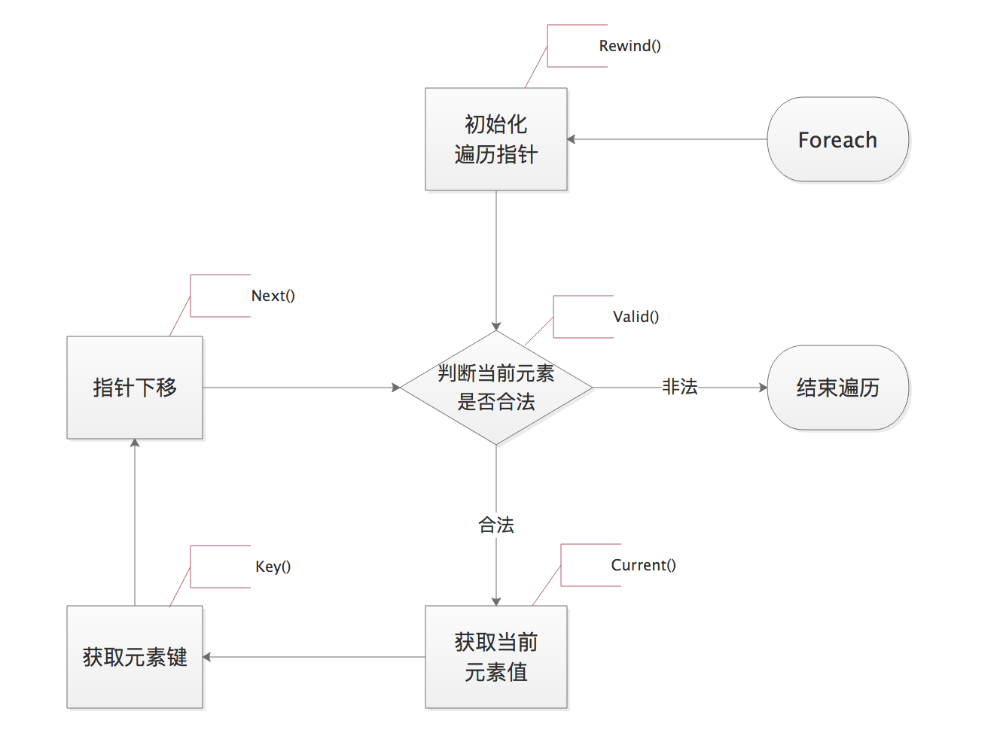

# PHP设计模式
### 什么是设计模式？ 
1. 设计模式是一套被反复使用、多数人知晓的、经过分类的、代码设计经验的总结。使用设计模式是为了可以重用代码，让代码更容易被他人理解，保证
代码的可靠性。

2. 设计模式是一种思想，跟编程语言关系不大，尽管不同语言实现设计模式不尽相同，但是思想核心是一致的。他们都要遵循设计模式的六大规则，设计
模式不一定就是完完整整的按照案例书写的，只要符合设计模式的六大规则就是好的设计模式。

3. 设计模式的六大规则
  - 单一职责：一个类只负责一项职责。
  - 里氏代换：子类可以扩展父类的功能，但不能够改变父类原有的功能。
  - 依赖倒置：高层模块不应该依赖底层模块，二者都应该依赖抽象；抽象不应该依赖细节；细节应该依赖抽象。
  - 接口隔离：一个类对另一个类的依赖应该建立在最小的接口上。
  - 迪米特法则：一个对象应该对其它对象保持最少的了解。
  - 开闭原则：一个软件实体的模块或函数，对实体扩展开放 对实体修改关闭。

---

### 下面用php实现如下的设计模式
+ [单例模式](#单例模式)
+ [简单工厂模式](#简单工厂模式)
+ [观察者模式](#观察者模式)
+ [建造者模式](#建造者模式)
+ [策略模式](#策略模式)
+ [责任链模式](#责任链模式)
+ [对象映射模式](#对象映射模式)
+ [队列消息模式](#队列消息模式)
+ [迭代器模式](#迭代器模式)
+ [注册树模式](#注册树模式)

## 单例模式
---
```
<?php

class Mysql{

    public function __construct(){

    }

    public function getInfo(){
        return 'the mysql version is 5.7. ';
    }

}

$db1 = new Mysql();
var_dump($db1);
echo $db1->getInfo();
echo PHP_EOL;
$db2 = new Mysql();
var_dump($db2);
echo $db2->getInfo();
echo PHP_EOL;

class Db{

    private static $_instance;

    private function __construct(){

    }

    //私有化克隆方法
    private function __clone(){

    }

    //只有这个入口可以获取db的实例
    //instanceof 用于确定一个 PHP 变量是否属于某一类 class 的实例：
    public  static function getInstance(){
        if(!(self::$_instance instanceof Db) ){
            self::$_instance = new Db();
        }
        return self::$_instance;
    }

    //获取数据库信息
    public function getInfo(){
        return 'the database is mysql';
    }

}

$db3 = Db::getInstance();
echo $db3->getInfo();
var_dump($db3);
echo PHP_EOL;
$db4 = Db::getInstance();
echo $db4->getInfo();
var_dump($db4);

```
#### 运行结果

```
object(Mysql)#1 (0) {
}
the mysql version is 5.7. 
object(Mysql)#2 (0) {
}
the mysql version is 5.7. 
the database is mysqlobject(Db)#3 (0) {
}

the database is mysqlobject(Db)#3 (0) {
}
```

#### 总结：
* db1，db2实现化后是两个不同的实例#1，#2
* db3,db4调用的单例的实例化方法，获取的实际上是一个实例#3
* 单例模式需要将构造方法设置为私有，防止外面生成新的实例，需要将clone方法设置为私有防止克隆
* 定义一个变量存储对象实例，如果对象实例是属于类创建的则直接返回，否则重新生成，保持类的实例只有一个存在

## 简单工厂模式
---
```
<?php

/**
*@desc 数据库接口类
**/
interface Db{
    public function connect();
    public function insert();
    public function delete();
    public function edit();
    public function find();
}
 
/***
*@desc mysql数据库操作类
**/ 
class Mysql implements Db{

    public function connect(){
        echo "mysql connect ok";
    }

    public function insert(){

    }

    public function delete(){

    }

    public function edit(){

    }

    public function find(){

    }


}

/**
*@desc sqlite数据库操作类
***/
class Sqlite implements Db{

    public function connect(){
        echo "sqlite connect ok";
    }

    public function insert(){

    }

    public function delete(){

    }

    public function edit(){

    }

    public function find(){

    }

}

/**
*@desc 工厂类
**/
class Factory{
    static $db = null;
    public static function createFactory($dbType){
        switch($dbType){
            case 'mysql':
                self::$db = new Mysql();
                break;
            case 'sqlite':
                self::$db = new Sqlite();
                break;
        }
        return self::$db;
    }
}


$db = Factory::createFactory('mysql');
$db->connect();

echo PHP_EOL;

$db = Factory::createFactory('sqlite');
$db->connect();

```
#### 运行结果
```
mysql connect ok
sqlite connect ok
```

#### 总结
1. 只需要传递一个参数就可以实例化想要的类
2. 使用者没有感知，可以统一数据库操作的方法
3. 方便数据库切换


## 观察者模式
---
#### 概念
观察者模式有时候被称为发布订阅模式，或者模型视图模式，在这个模式中，当一个对象生改变的时候，依赖它的对象会全部收到通知，并自动更新。
#### 使用场景
一件事情发生以后，要执行一连串的更新操作，传统的方法就是就是在事件之后加入直接加入处理逻辑，当更新的逻辑变的多了后，变变得难以维护，这种方式是耦合的，侵入式的，增加新的逻辑需要修改主题代码。
#### 实现方式
需要实现两个角色，观察者和被观察者对象。当被观察者发生改变的时候观察者观察者就会观察到这样的变化。

#### 角色分析
1. 观察者，观察变化的对象，以及观察者接收的通知处理实现。
2. 被观察者，添加观察者，删除观察者，通知观察者。

```
<?php

/**
*@desc 观察者
**/
interface Observer
{
    function update($lesson,$time);
}

/**
*@desc 被观察者抽象类
抽象类中不是必须有抽象方法，但是如果一个类有申明了抽象方法，那么这个类必须是抽象类，并且抽象类是不能够直接实例化的，如果要使用必须被继承
**/
abstract class Observable
{
    private $_obj = [];

    //添加观察者
    public function addObserver(Observer $observer){
        $this->_obj[] = $observer;
    }

    //通知观察者
    public function notify($lesson=null,$time=null){
        //遍历所有观察者通知对应的观察者
        foreach ($this->_obj as $observer) {
            $observer->update($lesson,$time);
        }
    }

}

/**
*因为定义的观察者抽象类不能够直接实例化，所以需要创建一个观察者来继承该类
*@desc 建立真实观察者对象
**/
class TrueObservable extends Observable
{
    private $_lesson='python';
    public function trgger($lesson='',$time='')
    {
        $this->_lesson = $lesson;
        $this->notify($lesson,$time);
    }
}

/***
*@desc 创建观察者对象老师
**/
class Obteacher implements Observer
{
    public $name;
    public function __construct($name){
        $this->name = $name;
    }
    public function update($lesson = '',$time=''){
        echo "老师".$this->name."您好，您".$time."的".$lesson."即将开始直播，提醒您做好必要的准备工作".PHP_EOL;
    }
} 


/***
*@desc 创建观察者对象学生
**/
class Obstudent implements Observer
{
    public $name;
    public function __construct($name){
        $this->name = $name;
    }
    public function update($lesson = '',$time=''){
        echo "学生".$this->name."你好，你预约的课程".$lesson."开始时间为".$time."请按时到达，祝你学习愉快".PHP_EOL;
    }
}

$obj = new TrueObservable();
$obj->addObserver(new Obteacher('张学友'));
$obj->addObserver(new Obstudent('刘德华'));
$obj->trgger('《php之设计模式》','2月19日下午2点');
```

#### 运行结果
```
老师张学友您好，您2月19日下午2点的《php之设计模式》即将开始直播，提醒您做好必要的准备工作
学生刘德华你好，你预约的课程《php之设计模式》开始时间为2月19日下午2点请按时到达，祝你学习愉快
```
#### 总结
该例子使用观察者模式，来实现当一个类的两个变量发生改变时，依赖它的对象会全部收到通知，并自动更新为当前的所传递的值的所属信息.

## 建造者模式
---
### 角色分析
以汽车为例子，建造者模式应该如下四个角色:
1. Product：产品角色,可以理解为行业规范，具体到一辆汽车的具有的功能和属性需要具体的建造者去完成，也就是汽车品牌公司去完成。
2. Builder:抽象的建造者角色,行业规范有了，具体建造者的抽象，将让构造者来具体需要实现的属性和功能抽象化，让各个品牌来实现。
3. ConcreateBuilder：具体建造者角色，具体的汽车品牌根据抽象的定义来实现汽车的属性和功能同时调用产品的具体构造一辆车。
4. Director：导演者角色，它是指挥者，指挥具体实例化那个建造者角色来驱动生成一辆真正的自己品牌的车。
---
```
<?php

/**
*@desc 产品类
定义car的具体属性和功能
**/
class Car{

    public $_brand;//品牌
    public $_model;//型号
    public $_type;//类型，是小汽车还是suv
    public $_price;//价格

    //输出车的功能信息
    public function getCarInfo(){
        return "恭喜您拥有了一辆，".$this->_brand.'的'.$this->_model.$this->_type."靓车，此车目前售价".$this->_price."w元";
    }

}

/**
*@desc 抽象的建造者类
**/
abstract class Builder{
    public $_car;//产品的对象
    public $_info=[];//参数信息
    public function __construct(array $info){
        $this->_car = new Car();
        $this->_info = $info;
    }

    abstract function buildBrand();

    abstract function buildModel();

    abstract function buildType();

    abstract function buildPrice();

    abstract function getCar();

}

/**
*@desc 具体的宝马车构造
**/
class BmwCar extends Builder{

    public function buildBrand(){
        $this->_car->_brand =  $this->_info['brand'];
    }

    public function buildModel(){
        $this->_car->_model =  $this->_info['model'];
    }

    public function buildType(){
        $this->_car->_type =  $this->_info['type'];
    }

    public function buildPrice(){
        $this->_car->_price =  $this->_info['price'];
    }

    /**
    *@desc 获取整个车的对象标示，让指挥者操作创建具体车
    **/
    public function getCar(){
        return $this->_car;
    }

}


/**
*@desc 具体的奥迪车构造
**/
class AudiCar extends Builder{

    public function buildBrand(){
        $this->_car->_brand =  $this->_info['brand'];
    }

    public function buildModel(){
        $this->_car->_model =  $this->_info['model'];
    }

    public function buildType(){
        $this->_car->_type =  $this->_info['type'];
    }

    public function buildPrice(){
        $this->_car->_price =  $this->_info['price'];
    }


    /**
    *@desc 获取整个车的对象标示，让指挥者操作创建具体车
    **/
    public function getCar(){
        return $this->_car;
    }

}


/***
*@desc 创建指挥者,指挥者调用具体的车的构造创建一辆真正的车
**/
class Director{
    public $_builder;//构造者对戏那个
    public function __construct($builder){
        $this->_builder = $builder;
    }

    //指挥方法，指挥生成一辆车
    public function Contruct(){
        $this->_builder->buildBrand();
        $this->_builder->buildModel();
        $this->_builder->buildType();
        $this->_builder->buildPrice();
        return $this->_builder->getCar();
    }

}

//创建一辆宝马车
$info = ['brand'=>'宝马','model'=>'525','type'=>'轿车','price'=>'50'];
$director = new Director(new BmwCar($info));
echo $director->Contruct()->getCarInfo();

echo PHP_EOL;


//创建一辆奥迪车
$info = ['brand'=>'奥迪','model'=>'Q5','type'=>'suv','price'=>'51'];
$director = new Director(new AudiCar($info));
echo $director->Contruct()->getCarInfo();
```

#### 运行结果
```
恭喜您拥有了一辆，宝马的525轿车靓车，此车目前售价50w元
恭喜您拥有了一辆，奥迪的Q5suv靓车，此车目前售价51w元
```

## 策略模式
---
#### 定义
在软件编程中可以理解为定义一系列算法，将一个个算法封装起来，也可以理解为一系列的处理方式，根据不同的场景使用对应的算法策略的一种设计模式。

#### 小故事
三国时期，刘备要去东吴，诸葛亮担心主公刘备出岔子，特意准备了三个锦囊，让赵云在适当时机打开锦囊，按其中方式处理，这三个锦囊妙计如下：
1. 第一个锦囊妙计：借孙权之母、周瑜之丈人以助刘备，终于弄假成真，使刘备得续佳偶。
2. 第二个锦囊妙计：周瑜的真美人计，又被诸葛亮的第二个锦囊计破了，它以荆州危急，借得孙夫人出头，向国太谎说要往江边祭祖，乃得以逃出东吴。尽管周瑜早为防备，孙权派人追捕。
3. 第三个锦襄妙计：又借得孙夫人之助，喝退拦路之兵。

#### 角色分析
1. 抽象策略角色，抽象的处理方式，通常由一个接口或抽象类实现。
2. 具体策略角色，具体的处理方式或者说是妙计。
3. 环境角色，也就是条件。

```
<?php

/**
*@desc 抽象的锦囊包类，也叫抽象策略类
**/
abstract class Strategy{
    abstract function Skill();
}

/**
*@desc 具体策略类，第一条锦囊妙计
**/
class oneStrategy extends Strategy{
    public function skill(){
        echo "借孙权之母、周瑜之丈人以助刘备，终于弄假成真，使刘备得续佳偶";
    }
}


/**
*@desc 具体策略类，第二条锦囊妙计
**/
class twoStrategy extends Strategy{
    public function skill(){
        echo "以荆州危急，借得孙夫人";
    }
}

/**
*@desc 具体策略类，第三条锦囊妙计
**/
class threeStrategy extends Strategy{
    public function skill(){
        echo "借得孙夫人之助，喝退拦路之兵";
    }
}

/**
*@desc 环境角色类
**/
class Control{

    private $_strategy;//存储策略类的对象
    public function __construct($strategy){
        $this->_strategy = $strategy;
    }

    //执行选择的锦囊妙计
    public function skillBag(){
        $this->_strategy->skill();
    }

}

$type = 2;//选择第一个锦囊妙计
switch ($type) {
    case '1':
        $obj = new Control(new oneStrategy());
        break;
    case 2:
        $obj = new Control(new twoStrategy());
        break;
    case 3: 
        $obj = new Control(new threeStrategy());
        break;
    default:
        $obj = new Control(new oneStrategy());
}
$obj->skillBag();
```

#### 运行结果
```
以荆州危急，借得孙夫人
```

## 责任链模式
---

## 队列消息模式
---
#### 在php框架中，启动框架时会去加载php框架生命周期中必须要运行的核心类，我们可以使用if来判断是否加载对应的类的先后，但是这种方式比较不容易维护。在这里我们来实现一个核心加载器，当框架运行的时候来驱动框架整个生命周期的核心类的调用。我们下面介绍使用php的队列消息模式的思想来实现PHP框架核心类加载。
```
<?php
/*
 * @desc 核心加载器
 */
class Loader{
    //需要加载对象数组
    private static $_objlist=[];
    //标示的调用方法为静态
    const _STATIC=1;
    //标示的方法为对象的
    const _OBJECT=2;
    //标示方法为静态的
    const _SIGNLE=3;

    /**
     * @desc 在对象前添加对象
     * @param $array
     */
    public static function unshiftObj($array){
        array_unshift(self::$_objlist,$array);
    }

    /***
     * @desc 监听对象个数用来遍历执行存储在数组的对象
     * @return bool
     */
    public static function listen(){
        if(count(self::$_objlist)>0){
            return true;
        }else{
            return false;
        }
    }

    /**
     * @desc 向对象末尾加入对象
     * @param $array
     */
    public static function pushObj($array){
        array_push(self::$_objlist,$array);
    }

    /**
     * @desc 依次执行需要加载的对象
     */
    public static function doObj(){
        //取出数组中的第一组数据
        $objArr = array_shift(self::$_objlist);
        //获取类名
        $className = $objArr[0];
        //获取方法名称
        $funcNmae = $objArr[1];
        //获取参数信息
        $params = $objArr[2];
        //获取调用类型，是静态直接调用，还是对象调用方法，还是单例模式的方法调用
        $type = $objArr[3];
        //使用call_user_func_array方法调用类对应的方法
        if($type==self::_STATIC){
            call_user_func_array([$className,$funcNmae],$params);
        }elseif ($type==self::_OBJECT){
            $obj = new $className();
            call_user_func_array([$obj,$funcNmae],$params);
        }elseif ($type==self::_SIGNLE){
            $signleObj = $className::getInstance();
            call_user_func_array([$signleObj,$funcNmae],$params);
        }
    }
}

class A{
    public static function  init(){
        echo "A类型调用静态方法init成功<br/>";
    }
}

class B{
    public  function add($name,$age=null){
        echo "B类通过对象方法调用add方法成功,参数name:{$name} , age:{$age}<br/>";
    }
}

class C{
    private static $_instance;

    private function __construct()
    {
    }

    private function __clone()
    {
        // TODO: Implement __clone() method.
    }

    /**
     * @desc 获取实例化对象的入口
     */
    public static function getInstance(){
        if(!(self::$_instance instanceof C)){
            self::$_instance = new C();
        }
        return self::$_instance;
    }

    public function show(){
        echo " C类单例类调用show方法成功<br/>";
    }

}

/**
 * 使用unshiftObj，pushObj方法决定类执行的先后顺序，实现类的核心加载
 */
Loader::unshiftObj(['A','init',[],Loader::_STATIC]);
Loader::unshiftObj(['B','add',['思琼哈哈哈',33],Loader::_OBJECT]);
Loader::pushObj(["C","show",[],Loader::_SIGNLE]);
while (Loader::listen()){
    Loader::doObj();
}

```
#### 运行结果如下
```
B类通过对象方法调用add方法成功,参数name:思琼哈哈哈 , age:33
A类型调用静态方法init成功
C类单例类调用show方法成功
```

## 迭代器模式
说到迭代器模式我们不得不说foreach，迭代器就是遍历的意思，在php中对对象有两种遍历方式：
- 1.普通遍历只能够遍历public属性
- 2.类实现了迭代器类的遍历
在php使用foreach遍历对象的时候，会检查这个实例没有实现Iterator接口，如果实现了就会内置使用迭代器的方式遍历对象
***
### 迭代器的流程图

### php迭代器方法执行流程图

```
class ArrayIterator implements \Iterator{

    private $info = ['a','b','c','d'];
    private $index;

    //第一步初始化遍历指针
    public function rewind()
    {
        $this->index = 0;
    }

    //第二步判断当前元素是否合法
    public function valid()
    {
        return $this->index<count($this->info);
    }

    //第三步获取当前元素值
    public function current()
    {
        return $this->info[$this->index];
    }

    //第四步获取当前元素键
    public function key(){
        return $this->index;
    }

    //第五步指针下移
    public function next()
    {
        $this->index++;
    }

}
//使用迭代器遍历对象属性
$arrayIter = new ArrayIterator();
foreach ($arrayIter as $key){
    var_dump($key);
}
//结果会将变量数组遍历出来
```

## 注册树模式
### 什么是注册树模式
注册树模式当然也叫注册器模式，注册器模式是将对象实例注册到一颗全局的对象树上，需要的时候从对象树上采摘的模式设计方法
### 为什么要采用注册树模式
单例模式解决的是如何在整个项目中创建唯一对象实例的问题，工厂模式解决的是如何不通过new建立实例对象的方法。注册树模式解决的是不管你是通过单例模式还是工厂模式还是二者结合生成的对象，都统统的“插到”注册树上。在使用对象的时候直接从树上取对象即可，这和我们使用全局变量一样方便实用。
### 注册树类
```
<?php
/**
 * @desc 注册树模式
 */
class Register{
    //存储对象到树上
    protected static $objects;

    /**
     * @param $alias
     * @param $object
     */
    public static function set($alias,$object){
        self::$objects[$alias] = $object;
    }

    /**
     * @desc 销毁对象实例
     * @param $alias
     */
    public static function _unset($alias){
        unset(self::$objects[$alias]);
    }

    /**
     * @desc 获取指定的对象实例
     * @param $alias
     * @return mixed
     */
    public static function get($alias){
        return self::$objects[$alias];
    }
}
```

### 操作mysqli的类
```
<?php
class Mysqli{
    protected $conn;
    /**
     * @desc 连接数据库
     * @param $host
     * @param $user
     * @param $passwd
     * @param $dbname
     */
    public function conn($host,$user,$passwd,$dbname){
        $conn = mysqli_connect($host,$user,$passwd,$dbname);
        $this->conn = $conn;
    }

    /**
     * @desc 获取数据库连接对象
     * @param $host
     * @param $user
     * @param $passwd
     * @param $dbname
     */
    static public function getConn($host,$user,$passwd,$dbname){
        $conn = mysqli_connect($host,$user,$passwd,$dbname);
        return $conn;
    }

    public function insert($sql)
    {
        // TODO: Implement insert() method.
    }

    public function update($sql)
    {
        // TODO: Implement update() method.
    }

    public function delete($sql)
    {
        // TODO: Implement delete() method.
    }

    /**
     * @desc 执行数据库
     * @param $sql
     */
    public function query($sql){
        return mysqli_query($this->conn,$sql);
    }

    /**
     * @desc 关闭数据库
     */
    public function close(){
        mysqli_close($this->conn);
    }

}
```

### 运行注册树
```
<?php
include "Register.php";
include "Mysqli.php";
//通过注册树的方式获取变量
Register::set('db',new Mysqli());
$db = Register::get('db');
$db->conn("localhost","root","","test");
$sql = "select * from admin";
$res = $db->query($sql);
print_r($res);
//运行结果会打印出admin表的数据
```


